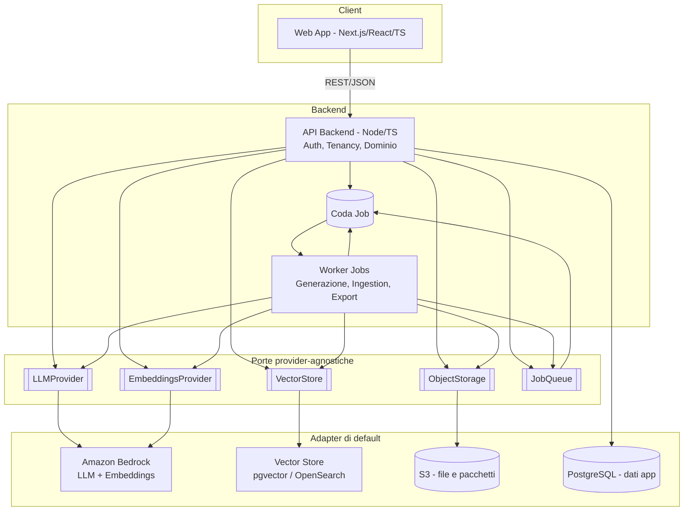
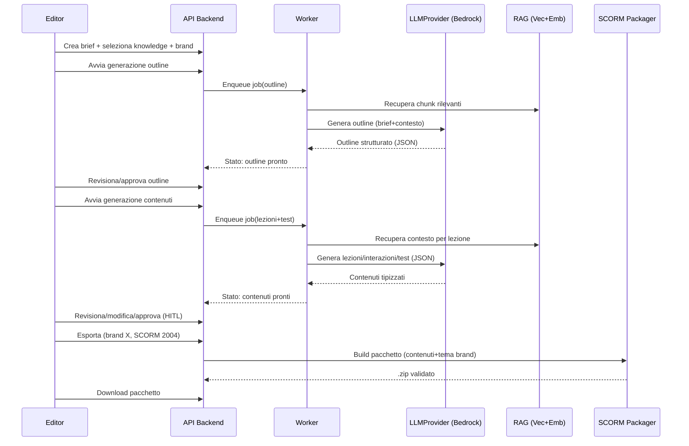
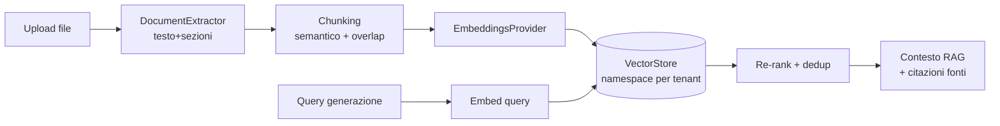
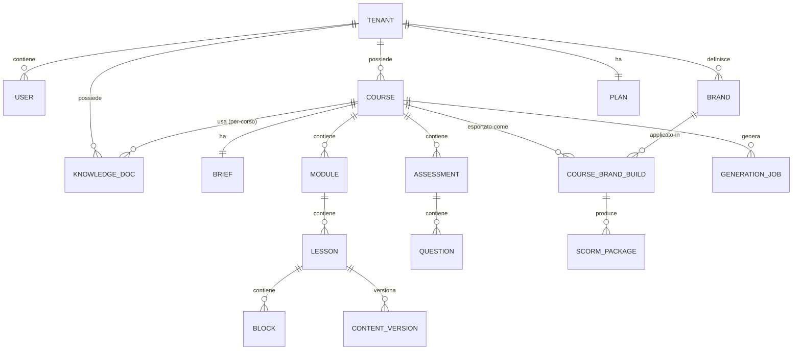
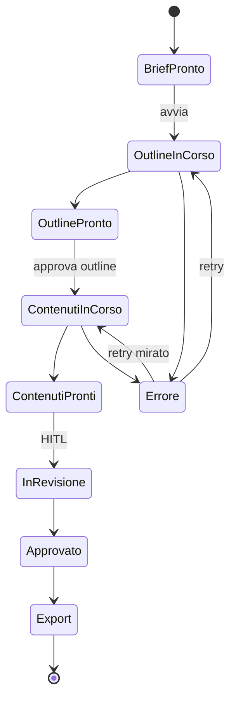

# Design — SCORM Course Generator

## Panoramica

SCORM Course Generator è un SaaS multi-tenant che trasforma un brief + una knowledge base in un corso e-learning completo, brandizzato ed esportabile come pacchetto SCORM. L'AI (via Amazon Bedrock, dietro astrazioni provider-agnostiche) genera outline, lezioni interattive e test; un editor human-in-the-loop permette revisione e rigenerazione mirata; un packager produce `.zip` SCORM 2004 4th Edition (primario) o 1.2 (opzionale), applicando il brand selezionato.

Il design segue tre principi guida:
1. **Dominio indipendente dall'infrastruttura** — la logica di corso/generazione dipende solo da porte (interfacce), non da Bedrock/AWS. Questo soddisfa il Requisito 10 (no vendor lock-in).
2. **Contenuto come dati tipizzati** — ogni lezione/interazione/test è un modello JSON validato da schema, separato dalla resa visiva. Il branding è un layer di token applicato in fase di rendering/export.
3. **Pipeline asincrona e osservabile** — la generazione AI è a job, con stato, retry mirato e audit di modello/costi.

> Nota di scope: questo documento definisce l'architettura target. L'implementazione sarà incrementale (vedi `tasks.md`), con i provider esterni (Bedrock, vector store) mockabili per sviluppare end-to-end anche senza credenziali.

---

## Architettura

### Vista a container



### Flusso principale (brief → pacchetto SCORM)



### Stile architetturale
- **Hexagonal / Ports & Adapters** sul backend: il core di dominio (corso, generazione, packaging) espone porte; gli adapter concreti (Bedrock, pgvector, S3) sono selezionati via configurazione. Soddisfa Req. 10.
- **CQRS leggero**: comandi (muta stato, accoda job) separati da query (lettura modelli di corso). Non serve event sourcing in v1.
- **Job-based** per operazioni lunghe (ingestion knowledge, generazione, export).

---

## Stack tecnologico

| Area | Scelta | Motivazione |
|---|---|---|
| Frontend | Next.js (App Router) + React + TypeScript | SSR/CSR flessibile, ecosistema maturo, un solo linguaggio FE/BE |
| Editor contenuti | React + libreria rich-text (es. TipTap/ProseMirror) | Editing strutturato HITL con output pulito/sanificabile |
| Backend | Node.js + TypeScript (NestJS o Fastify) | Condivisione tipi con FE, DI nativa (NestJS) utile per ports/adapters |
| DB applicativo | PostgreSQL | Relazionale + JSONB per contenuti; estensione pgvector disponibile |
| Vector store | pgvector (default) con adapter alternativo OpenSearch Serverless | Semplicità operativa in v1, scalabilità opzionale enterprise |
| Object storage | S3 (adapter astratto) | File sorgente, media, pacchetti SCORM |
| Coda job | SQS o Postgres-backed (adapter astratto) | Disaccoppiamento worker; sostituibile |
| AI LLM/Embeddings | Amazon Bedrock (default) dietro `LLMProvider`/`EmbeddingsProvider` | Modelli di frontiera; nessun lock-in grazie all'astrazione |
| Auth | OIDC/JWT (es. Cognito o Auth0) dietro astrazione | Enterprise SSO possibile; multi-tenant |
| SCORM runtime | Modulo JS vanilla incluso nel pacchetto | Deve girare offline nell'LMS, zero dipendenze esterne |

> Nota: NestJS è consigliato per la DI che rende naturale il pattern ports/adapters, ma Fastify + un container DI leggero è un'alternativa valida. La scelta non impatta il dominio.

---

## Astrazione dei provider (porte)

Interfacce di dominio (TypeScript, semplificate):

```ts
interface LLMProvider {
  readonly id: string;
  generate(input: {
    system?: string;
    messages: ChatMessage[];
    schema?: JSONSchema;        // generazione strutturata/tool-use
    temperature?: number;
    maxTokens?: number;
  }): Promise<LLMResult>;        // include usage per audit costi
  stream?(input: GenerateInput): AsyncIterable<LLMChunk>;
}

interface EmbeddingsProvider {
  readonly id: string;
  embed(texts: string[]): Promise<number[][]>;
  readonly dimensions: number;
}

interface VectorStore {
  upsert(ns: TenantScope, items: VectorItem[]): Promise<void>;
  query(ns: TenantScope, vector: number[], k: number, filter?: VecFilter): Promise<VecMatch[]>;
  deleteByDocument(ns: TenantScope, documentId: string): Promise<void>;
}

interface ObjectStorage {
  putObject(key: string, body: Buffer | Stream, meta?: ObjMeta): Promise<void>;
  getSignedUrl(key: string, opts: { expiresInSec: number }): Promise<string>;
  deleteObject(key: string): Promise<void>;
}

interface JobQueue {
  enqueue<T>(type: JobType, payload: T, opts?: EnqueueOpts): Promise<JobId>;
  // il worker si registra come handler per JobType
}

interface DocumentExtractor {           // ingestion knowledge multi-formato
  supports(mime: string): boolean;
  extract(file: FileRef): Promise<ExtractedDoc>; // testo + struttura/sezioni
}
```

- Adapter di default: `BedrockLLMProvider`, `BedrockEmbeddingsProvider`, `PgVectorStore`, `S3ObjectStorage`, `SqsJobQueue`.
- Registrazione via config per ambiente/tenant (Req. 10.3/10.4). Credenziali solo server-side (Req. 10.5, 12).
- Per sviluppo/test: `MockLLMProvider` deterministico e `InMemoryVectorStore`.

---

## Pipeline Knowledge e RAG



- **Ingestion** come job: estrazione → chunking (per sezione, con overlap) → embeddings → upsert nel vector store con metadati `{tenantId, scope: global|course, courseId?, documentId, section}`.
- **Retrieval** in generazione: la query combina obiettivo della lezione + brief; si recuperano chunk da scope globale e per-corso, con filtro per tenant (isolamento Req. 1.2) e re-rank. Si tracciano le fonti per citazioni (Req. 3.6, 4.8).
- **Eliminazione** documento → `deleteByDocument` rimuove gli embeddings (Req. 3.7).
- Dimensione embeddings e metrica dipendono dall'`EmbeddingsProvider` selezionato; la colonna/indice pgvector è configurata di conseguenza.

---

## Modello dati

### Entità principali (relazionali)



- **Tenant/User/Plan**: multi-tenancy, ruoli, quote/feature flag (Req. 1).
- **Brand**: asset e token (Req. 7). Vedi sotto.
- **KnowledgeDoc**: metadati del documento; `scope` globale o per-corso; stato ingestion.
- **Course → Module → Lesson → Block**: la gerarchia dei contenuti. Un `Block` è una singola interazione tipizzata (schema per tipo).
- **Assessment → Question**: test intermedi/finali; i tipi di domanda hanno schema dedicato.
- **CourseBrandBuild**: materializzazione "corso + brand" da cui nasce un `ScormPackage` (consente stesso corso, più brand → più pacchetti, Req. 7.3, 9.7).
- **GenerationJob**: stato, modello, prompt, parametri, usage/costo, correlation id (Req. 4.7, 11).
- **ContentVersion**: cronologia versioni per HITL (Req. 8.5).

I contenuti ricchi (block/question payload) sono memorizzati come **JSONB** validato da JSON Schema versionato.

### Modello Brand (token)

```ts
interface Brand {
  id: string; tenantId: string; name: string;
  assets: {
    logoPrimaryUrl: string;
    logoInverseUrl?: string;
    faviconUrl?: string;
  };
  colors: {                 // mappati a CSS custom properties
    primary: string; onPrimary: string;
    secondary?: string; surface: string; onSurface: string;
    success: string; warning: string; error: string;
  };
  typography: {
    fontFamilyHeading: string; fontFamilyBody: string;
    scale?: Record<string, string>; // es. h1..small
    webFontUrls?: string[];          // self-hosted nel pacchetto
  };
  voice?: { tone: string; dosAndDonts?: string[] }; // influenza i prompt (Req. 7.4)
  legal?: { disclaimer?: string; footerText?: string };
}
```

- Il tema brand è compilato in un file `theme.css` (CSS custom properties) incluso nel pacchetto; i renderer delle interazioni consumano i token senza duplicare logica (Req. 7.5).
- I web font vengono **self-hosted** nel pacchetto per garantire funzionamento offline nell'LMS (Req. 9.4). Fallback su font di sistema se mancanti (Req. 7.6).
- Il `voice.tone` viene iniettato nei prompt di generazione (Req. 7.4), con precedenza del tono di brand su quello generico del brief se configurato.

---

## Catalogo delle interazioni

Ogni interazione è un `Block` con `type` + `payload` conforme a schema, e un **renderer runtime** incluso nel pacchetto. Catalogo v1:

| Tipo | Descrizione | Valutabile |
|---|---|---|
| `rich_text` | Testo didattico formattato, callout, liste | No |
| `image_hotspot` | Immagine con punti cliccabili che rivelano info | Sì (opz.) |
| `accordion_tabs` | Contenuti espandibili / a schede | No |
| `flashcard` | Carte fronte/retro per memorizzazione | No |
| `timeline` | Sequenza cronologica di eventi | No |
| `dragdrop_match` | Abbinamento elementi (sinistra↔destra) | Sì |
| `dragdrop_order` | Ordinamento/sequenziamento | Sì |
| `click_reveal` | Click per rivelare contenuto progressivo | No |
| `branching_scenario` | Scenario a scelte con esiti/scoring | Sì (opz.) |
| `video_checkpoint` | Video con domande ai punti di controllo | Sì |
| `carousel_steps` | Procedura step-by-step | No |

Tipi di domanda per gli `Assessment` (Req. 6.1):
`single_choice`, `multiple_choice`, `true_false`, `short_text`, `matching`, `ordering`, `fill_blank`, più valutazioni interattive derivate dai Block (`dragdrop_*`, `image_hotspot`, `branching_scenario`).

Principi comuni:
- **Schema tipizzato** per ogni tipo (validazione in generazione e in editing, Req. 5.3).
- **Renderer accessibile**: tastiera, ARIA, contrasto conforme (Req. 5.5), con il tema brand applicato via token.
- **Separazione contenuto/resa**: il payload non contiene stile; lo stile viene dal tema.

---

## Generazione AI

Pipeline in due fasi (Req. 4.1/4.2) per dare un punto di revisione precoce:

1. **Outline**: dal brief + contesto RAG → struttura `moduli → lezioni → obiettivi → tipi di test` in JSON strutturato (generazione vincolata da schema/tool-use). Revisione umana prima di proseguire.
2. **Contenuti**: per ogni lezione, generazione dei `Block` (scelta dei tipi di interazione coerente con l'obiettivo, Req. 5.2) e degli `Assessment`. Media come **placeholder** descrittivi (alt text, prompt immagine) da sostituire in revisione.

Caratteristiche:
- **Generazione strutturata**: si usa output conforme a JSON Schema (tool/function calling del provider) per avere `Block`/`Question` direttamente validabili, riducendo parsing fragile.
- **Grounding/RAG**: contesto recuperato e citazioni delle fonti incluse come metadati del contenuto (Req. 4.8).
- **Asincronia e retry mirato**: ogni elemento è un sotto-job; il fallimento di uno consente retry singolo senza rigenerare tutto (Req. 4.4/4.5).
- **Rigenerazione mirata HITL**: comandi tipo "rigenera questa lezione" / "tono più formale" operano sul singolo elemento preservando il resto (Req. 8.4), creando una nuova `ContentVersion`.
- **Audit**: ogni chiamata registra modello, prompt, parametri, usage/costo stimato, correlation id (Req. 4.7, 11).
- **Prompting a livelli**: system prompt di dominio + regole di brand (voice) + brief + contesto RAG. Il tono di brand ha effetto sui prompt (Req. 7.4).



---

## Packaging SCORM

### Struttura del pacchetto (`.zip`)

```
/imsmanifest.xml                 # organizzazione, risorse, (2004) sequencing+navigation
/metadata/ (opzionale LOM)
/assets/
  /theme/theme.css               # token del brand compilati
  /fonts/...                     # web font self-hosted
  /logos/...                     # asset brand
  /media/...                     # immagini/video del corso
/runtime/
  scorm-api.js                   # wrapper Run-Time API (find handle, Init, Get/Set, Commit, Terminate)
  player.js                      # player SPA che renderizza i Block/Assessment dal JSON
  renderers/*.js                 # renderer per ciascun tipo di interazione
/content/
  course.json                    # modello del corso (moduli/lezioni/block/assessment)
/pages/
  index.html                     # entrypoint SCO
  lesson-*.html / sco-*.html     # SCO secondo granularità scelta
```

### Decisioni di packaging
- **Target primario SCORM 2004 4th Edition** con `imsmanifest.xml` completo di `imsss` (sequencing) e `adlnav` (navigation); **SCORM 1.2** opzionale con manifest ridotto e mapping API corrispondente (Req. 9.1/9.2).
- **Granularità SCO**: in v1 ogni modulo (o lezione) è uno SCO, con un `course.json` che il player renderizza. Questo semplifica il sequencing dei test intermedi/finali e il tracking di completion/score (Req. 9.3/9.8).
- **Run-Time API wrapper** (`scorm-api.js`): localizza l'handle dell'API risalendo i frame (`API_1484_11` per 2004, `API` per 1.2), espone `init/get/set/commit/terminate` e mappa i modelli dati (`cmi.completion_status`, `cmi.success_status`, `cmi.score.*`, `cmi.suspend_data`, `cmi.location` per bookmarking). Degradazione controllata se l'API non è presente (anteprima fuori LMS).
- **Mapping risultati test** → `score.scaled/raw`, `success_status`, `completion_status` secondo mastery score (Req. 6.5).
- **Sequencing** per prerequisiti: i test intermedi/finali rispettano condizioni di completamento tramite regole `imsss` (Req. 9.8).
- **Offline-first**: nessuna dipendenza da rete esterna a runtime; tutto (JS, CSS, font, media) è nel pacchetto (Req. 9.4).
- **Validazione pre-export**: validazione del manifest (schema + regole minime per profilo SCORM) e controllo integrità risorse referenziate; blocco con errori chiari se non conforme (Req. 9.5).
- **Sanificazione**: l'HTML/rich-text generato viene sanificato prima di finire nel pacchetto per prevenire XSS nell'LMS (Req. 12.3).
- **Branding in export**: il `CourseBrandBuild` seleziona il brand; il packager compila `theme.css`, inserisce logo/font/legal e produce un `ScormPackage` versionato. Lo stesso corso con brand diversi → pacchetti distinti (Req. 7.3, 9.7).

### Compatibilità LMS
Per massimizzare la compatibilità con Moodle, Cornerstone, SuccessFactors, Docebo (Req. 9.6):
- Attenersi al profilo SCORM standard, evitando feature di sequencing esotiche poco supportate.
- `Commit` periodico e su eventi chiave; `Terminate` robusto a unload della pagina.
- Nomi file/path ASCII, dimensioni pacchetto ragionevoli, `suspend_data` entro i limiti del profilo.

---

## Multi-tenancy, piani e sicurezza

- **Isolamento tenant**: ogni query e ogni namespace del vector store è filtrato per `tenantId`; a livello DB si valuta Row-Level Security di Postgres per difesa in profondità (Req. 1.2, 12.5).
- **Ruoli**: Owner/Admin/Editor/Viewer con autorizzazione a livello di API (Req. 1.1/1.3).
- **Piani/quote**: `Plan` con feature flag e limiti (numero corsi, dimensione knowledge, numero brand, export). Enforcement con messaggi chiari e consumo esposto (Req. 1.4/1.5, 11.4).
- **Sicurezza dati**: cifratura a riposo e in transito; URL firmati a scadenza per file e pacchetti; validazione/sanitizzazione input e file upload; sanificazione HTML del pacchetto (Req. 12).
- **Credenziali provider** solo server-side, mai esposte al client (Req. 10.5).

---

## Osservabilità e audit

- **Log strutturati** con correlation id propagato da API a worker a chiamate provider (Req. 11.2).
- **Metriche di generazione**: modello, token/costo stimato, durata, esito per tenant (Req. 11.1).
- **Audit trail** delle azioni rilevanti (CRUD contenuti, export, delete) con utente/timestamp/tenant (Req. 11.3).

---

## Gestione errori

| Scenario | Comportamento |
|---|---|
| Formato file non supportato (ingestion) | Rifiuto con messaggio chiaro; nessun embedding creato (Req. 3.2) |
| Fallimento generazione elemento | Job in `Errore`; retry mirato del singolo elemento (Req. 4.5) |
| Provider AI non disponibile / rate limit | Backoff + retry; fallback provider se configurato; stato osservabile |
| Asset brand mancante/non valido | Fallback (font/logo di sistema) + segnalazione (Req. 7.6) |
| Manifest SCORM non valido in export | Blocco export + report errori; nessun pacchetto prodotto (Req. 9.5) |
| Export con elementi non approvati | Avviso; possibilità di forzare esplicitamente (Req. 8.3) |
| Conflitto editoriale multi-utente | Lock o avviso di conflitto; niente sovrascrittura silenziosa (Req. 8.6) |

---

## Strategia di test

- **Unit**: schemi dei Block/Question (validazione), compilazione tema brand, mapping Run-Time API, generazione manifest.
- **Contract test** sulle porte provider (`LLMProvider`, `EmbeddingsProvider`, `VectorStore`, `ObjectStorage`) con adapter mock e reali.
- **Golden tests** sul packager: dato un `course.json` + brand, il `.zip` prodotto ha struttura e `imsmanifest.xml` attesi e supera la validazione di profilo.
- **Validazione SCORM**: verifica del manifest contro i requisiti del profilo (2004 4th / 1.2) e test di import sui principali LMS (manuale/periodico).
- **E2E** del flusso brief→outline→contenuti→revisione→export con `MockLLMProvider` deterministico, così da girare senza credenziali Bedrock.
- **Accessibilità**: controlli automatici (assi/axe-core) sui renderer delle interazioni; la conformità WCAG completa richiede test manuali con tecnologie assistive e review esperta.

---

## Decisioni aperte / da confermare in implementazione
1. **Framework backend**: NestJS (DI integrata, consigliato) vs Fastify + DI leggera.
2. **Vector store di default**: pgvector (semplice) vs OpenSearch Serverless (scalabilità enterprise) — si parte con pgvector, adapter OpenSearch previsto.
3. **Auth**: Cognito vs Auth0 vs self-hosted OIDC — dietro astrazione, decisione per ambiente.
4. **Granularità SCO**: per-modulo (default v1) vs per-lezione — impatta sequencing e tracking.
5. **Generazione media**: in v1 placeholder; valutare in seguito generazione immagini (Bedrock image models) dietro la stessa astrazione provider.
